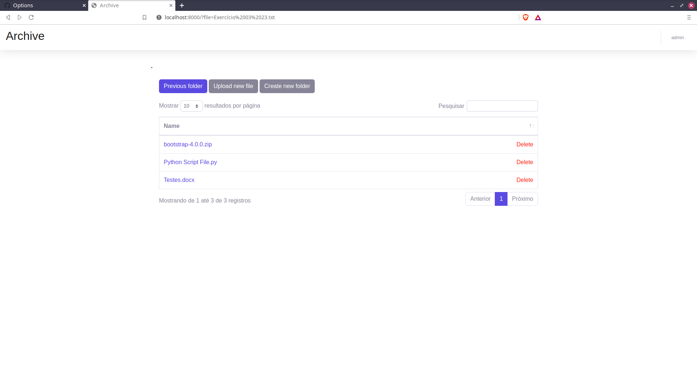

# Simple File Manager with Authentication System

This is a simple file manager protected by Django authentication system that allows an user to download, upload and delete files and create folders inside the protected media folder.



## Running the application

To run this application, you must have `python3-venv` and `python3-pip` installed.

Simply clone the repository, create a Python virtual environment and install the requirements in `requirements.txt`. Then, migrate the database, create a super user to login and run the server.

```
python3 -m venv venv
source venv/bin/activate
python3 manage.py migrate
python3 manage.py createsuperuser
python3 manage.py runserver

```
